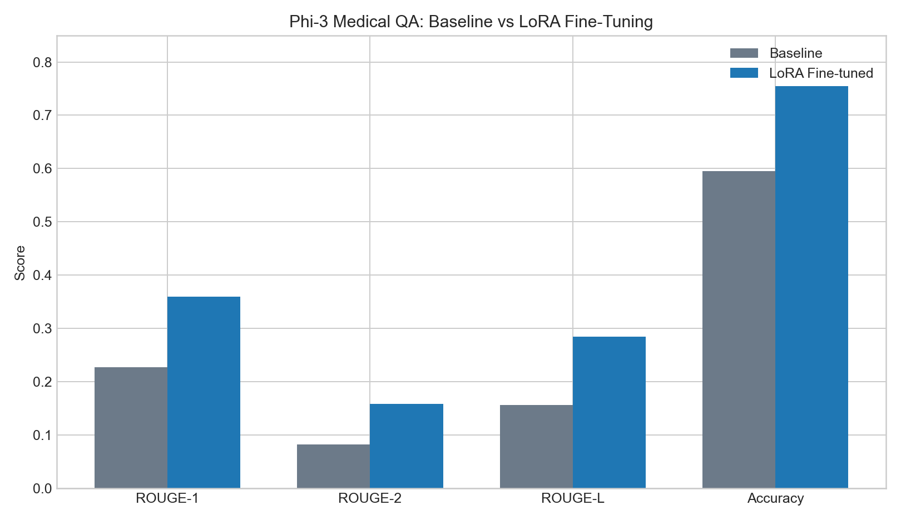
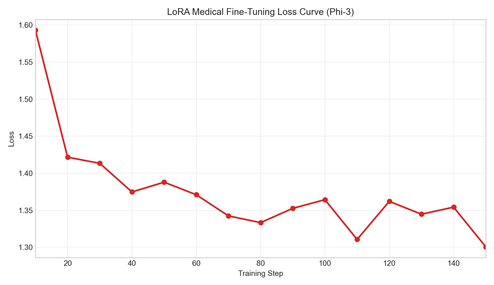
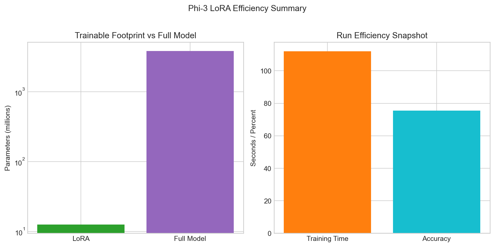

# CMPE 252 Final Project: PEFT Adaptation for Domain-Specific QA

This repository contains my CMPE 252 final project on parameter-efficient fine-tuning for domain-specific question answering. The project studies whether lightweight adaptation methods can improve medical and legal task performance without the cost of full-model retraining.

## Project Goal

The central question is whether parameter-efficient fine-tuning methods such as LoRA, AdaLoRA, IA3, and QLoRA can materially improve the performance of open-source instruction-tuned language models on specialized QA tasks.

## Research Questions

- Does in-domain LoRA fine-tuning improve performance over the base model?
- How much does performance degrade under cross-domain transfer?
- How close can PEFT methods get to full fine-tuning quality?
- What tradeoffs appear across accuracy, ROUGE, training time, and parameter count?

## Models and Domains

| Category | Details |
|---|---|
| Primary model completed so far | Phi-3-Mini-4k-instruct |
| Additional planned models | LLaMA, Qwen, Mistral |
| Medical datasets | PubMedQA, MedQuAD |
| Legal datasets | LegalQAEval, Caselaw-related sources |
| PEFT methods | LoRA, AdaLoRA, IA3, QLoRA |

## Repository Layout

| Path | Purpose |
|---|---|
| `notebooks/` | Experiment scripts for baseline, LoRA, AdaLoRA, IA3, and QLoRA runs |
| `results/experiment_results.md` | Recorded experiment outcomes and observations |
| `report/` | Final report source, bibliography, and writing material |
| `figures/` | Charts generated from the current experiment results |
| `docs/` | Planning, methodology, setup, and background notes |
| `CMPE-252_Ravikumar_FinalProjectProposal.pdf` | Original proposal submitted for the project |

## Reproducibility

The main Python dependencies used across the experiment scripts are listed in `requirements.txt`. The environment notes remain in `docs/01_Environment_Setup.md`, while the scripts in `notebooks/` capture the specific experiment flows.

## Quick Start

```bash
pip install -r requirements.txt
```

Then review these entry points:

- `notebooks/6.1_baseline_evaluation.py`
- `notebooks/6.2_lora_medical_finetuning.py`
- `results/experiment_results.md`
- `report/main.tex`

## Current Completed Results

The strongest completed comparison in this repository is the Phi-3 medical QA track using PubMedQA.

| Metric | Baseline | LoRA Fine-tuned | Improvement |
|---|---:|---:|---:|
| ROUGE-1 | 0.2265 | 0.3594 | +59% |
| ROUGE-2 | 0.0822 | 0.1578 | +92% |
| ROUGE-L | 0.1557 | 0.2848 | +83% |
| Accuracy | 59.50% | 75.50% | +16.00 points |

## Training Snapshot

| Setting | Value |
|---|---|
| Model | Phi-3-Mini-4k-instruct |
| Dataset | PubMedQA |
| LoRA rank | 16 |
| LoRA alpha | 32 |
| Dropout | 0.05 |
| Trainable parameters | 12,582,912 |
| Total model parameters | 3,833,662,464 |
| Training time | 112 seconds |
| Precision | bfloat16 |
| Optimizer | `adamw_8bit` |

## Visual Summary

### Baseline vs LoRA



### Training Loss Curve



### Efficiency Snapshot



## Why This Repo Is Different

This repository is intentionally not a direct copy of a teammate's project layout. It keeps the full development trail together:

- proposal and planning notes
- experiment-by-experiment implementation scripts
- recorded results and observations
- report assets for final submission
- generated visual summaries tied to the measured outputs already completed

## Experiment Coverage

| Experiment | Status |
|---|---|
| 6.1 Baseline evaluation | Complete for Phi-3 medical |
| 6.2 In-domain LoRA | Complete for Phi-3 medical |
| 6.3 In-domain legal LoRA | In progress |
| 6.4 Cross-domain transfer | Planned |
| 6.5 Training-size ablation | Planned |
| 6.6 LoRA vs full fine-tuning | Planned |
| 6.8 AdaLoRA | Script prepared |
| 6.9 IA3 | Script prepared |
| 6.10 QLoRA | Script prepared |

## Main Files To Review

- `results/experiment_results.md` for the measured outcomes
- `notebooks/6.1_baseline_evaluation.py` for the baseline evaluation workflow
- `notebooks/6.2_lora_medical_finetuning.py` for the LoRA medical experiment
- `report/main.tex` for the report draft
- `docs/06_Experiment_Plan.md` for the full experiment roadmap

## Author

Ravikumar  
MS AI / CMPE 252 Final Project
